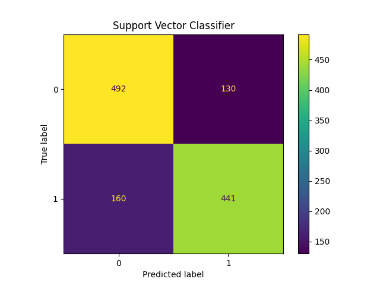

# 🧠 Bank Customer Churn Prediction with MLflow & Model Tracking

This project aims to predict whether a customer will leave a bank ("churn") using machine learning models trained and logged with MLflow. The dataset contains demographic and banking behavior information about U.S. bank customers.

---

## 📊 Dataset

- **Source:** [Bank Customer Churn Prediction Dataset on Kaggle](https://www.kaggle.com/datasets/shantanudhakadd/bank-customer-churn-prediction/data)
- **Target:** `Exited` column (1 = churned, 0 = stayed)

---

## 🧪 Models Tested

The following models were evaluated during experimentation:

- Logistic Regression
- Decision Tree
- Random Forest
- **Support Vector Classifier (SVC)** ✅

All models were evaluated using MLflow. Metrics such as accuracy, precision, recall, and F1 score were logged automatically, along with artifacts like data samples, preprocessing transformers, and confusion matrices.

---

## 🔍 Final Model Choice

### ✅ Why I Chose SVC as the Best Model

After comparing different models based on their performance, **Support Vector Classifier** was chosen as the best model. It achieved the best overall balance between **precision and recall**.

Below is the confusion matrix for the final SVC model:



---

## ⚙️ Requirements

All necessary dependencies are listed in the [`requirements.txt`](./requirements.txt) file.

To recreate the environment:

```bash
conda create -n churn_prediction python=3.12
conda activate churn_prediction
pip install -r requirements.txt
